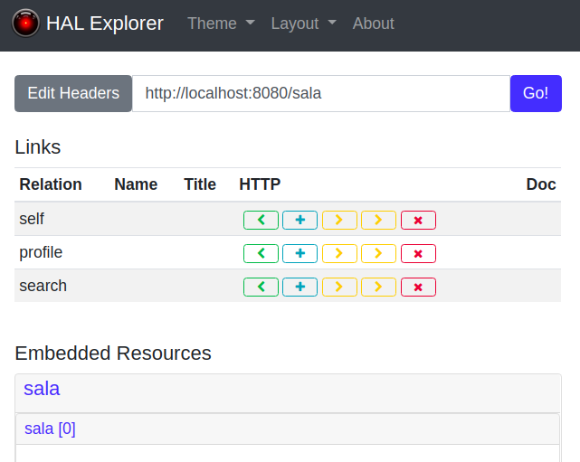
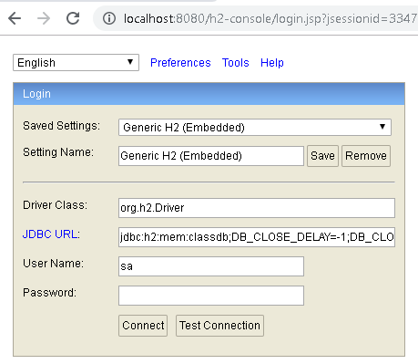

# ERP Server ZoomX
## Descripción
Servidor de apoyo para Obligatorio 2020 de la asignatura "Programación de Aps. Distribuidas Java/.NET".  
**Carrera**: Analista en Informática / Universidad de la Empresa. 

## Ejecución  (Requiere java 8, se recomienda java 11)
El jar generado en la compilación queda con el nombre "erp-server-zoomx-0.0.1-SNAPSHOT.jar" en la ruta target/. Su ejecución se hace con:   
`$ java -jar erp-server-zoomx-0.0.1-SNAPSHOT.jar --server.port=XXXX`   
El puerto por default es 8080. Si se desea cambiar se puede usar la opción *--server.port=XXXX* para especificar el puerto de publicación de la aplicación. 

## Recursos disponibles
**Salas**:   
*URL*: http://localhost:8080/sala/

**Búsqueda de salas**:
* **Por fecha**: http://localhost:8080/sala/search/findAllByFechaDeReserva?fechaDeReserva={fechaDeReserva}
* **Por nombre**: http://localhost:8080/sala/search/findAllByNombreContains?nombre={nombre}
* **Por responsable**: http://localhost:8080/sala/search/findAllByResponsableContains?responsable={responsable}

**Usuario**:   
*URL*: http://localhost:8080/usuario/

## Usuarios y roles
Se tienen dos roles "**ROLE_ADMIN**" y "**ROLE_USER**" con usuarios pre cargados.      
___
Con rol "**ROLE_USER**":    

*Usuario*: user
*Contraseña*: user

*Usuario*: usr
*Contaseña*: usr
___    
Con rol "**ROLE_ADMIN**":   
    
*Usuario*: admin
*Constraseña*: admin
   
*Usuario*: adm
*Contraseña*: adm

## Seguridad y recursos
El acceso a los recursos está protegido por autenticación HTTP Basic. Las URL y métodos permitidos por rol se describen a continuación:

*URL*: /sala/**   
*Métodos HTTP permitidos*: POST(ROLE_ADMIN), DELETE(ROLE_ADMIN), PUT(ROLE_ADMIN), PATCH(ROLE_ADMIN), GET(ROLE_ADMIN, ROLE_USER)

*URL*: /usuario/**   
*Métodos HTTP permitidos*: GET(ROLE_ADMIN, ROLE_USER)  

## Tipos de peticiones soportadas
### GET (Select de registro)
*Ejemplo de petición con rol ROLE_ADMIN*:

```kotlin
@Test
@Throws(IOException::class)
fun givenAuthUser_whenGetUsuario_thenGetResponseOk() {
  val client = OkHttpClient()
  val request = Request.Builder()
      .url("http://localhost:8080/usuario")
      .header("Authorization", Credentials.basic("adm", "adm"))
      .build()
  val rolExpected = "ROLE_ADMIN"

  val response = client.newCall(request).execute()

  assertSoftly {
    it.assertThat(response.code).isEqualTo(200)
    it.assertThat(response.body!!.string()).contains(rolExpected)
  }
  response.close()
}
```
*Respuesta*:   
Código HTTP: **200** OK   
Body (Objeto consultado):  

```json
{
  "password": null,
  "username": "admin",
  "authorities": [
    {
      "authority": "ROLE_ADMIN"
    }
  ],
  "accountNonExpired": true,
  "accountNonLocked": true,
  "credentialsNonExpired": true,
  "enabled": true
}
```

### POST (Insert de registro)
*Ejemplo de petición con rol ROLE_ADMIN*:   

```kotlin
@Test
@Throws(IOException::class)
fun givenAdmin_whenPostSala_thenGetResponse201() {
  val client = OkHttpClient()
  val JSON = "application/json; charset=utf-8".toMediaTypeOrNull()
  val json = """
    {
      "nombre": "Sala Z",
      "responsable": "Carlos C.",
      "fechaDeReserva": "2020-11-21T11:00:00",
      "tiempoReservaEnHoras": 2,
      "icono": "https://cdn.pixabay.com/photo/2020/09/13/13/00/charles-bridge-5568178_960_720.jpg"
    }
  """
  val body = json.toRequestBody(JSON)
  val request = Request.Builder()
      .url("http://localhost:8080/sala")
      .header("Authorization", Credentials.basic("adm", "adm"))
      .post(body).build()

  val response = client.newCall(request).execute()

  assertThat(response.code).isEqualTo(201)
  response.close()
}
```
*Respuesta*:   
Código HTTP: **201** Created   
Body (Objeto creado):  

```json
{
  "nombre": "Sala Z",
  "responsable": "Carlos C.",
  "fechaDeReserva": "2020-11-21T11:00:00",
  "tiempoReservaEnHoras": 2,
  "icono": "https://cdn.pixabay.com/photo/2020/09/13/13/00/charles-bridge-5568178_960_720.jpg",
  "_links": {
    "self": {
      "href": "http://localhost:8080/sala/5"
    },
    "sala": {
      "href": "http://localhost:8080/sala/5"
    }
  }
}
```

### PATCH (Update de todo un registro)
*Ejemplo de petición con rol ROLE_ADMIN*:   

```kotlin
@Test
@Throws(IOException::class)
fun givenAdmin_whenPatchSala_thenGetResponse204() {
  val client = OkHttpClient()
  val JSON = "application/json; charset=utf-8".toMediaTypeOrNull()
  val json = """
    {
      "nombre": "Sala 123",
      "responsable": "Carlos C.",
      "fechaDeReserva": "2020-11-20T10:00:00",
      "tiempoReservaEnHoras": 2,
      "icono": "https://cdn.pixabay.com/photo/2015/05/14/16/02/sandcastle-766949_960_720.jpg"
    }
  """
  val body = json.toRequestBody(JSON)
  val request = Request.Builder()
      .url("http://localhost:8080/sala/1")
      .header("Authorization", Credentials.basic("adm", "adm"))
      .patch(body).build()

  val response = client.newCall(request).execute()

  assertThat(response.code).isEqualTo(204)
  response.close()
}
```

*Respuesta*:   
Código HTTP: **204** OK     
Body (Objeto actualizado):   

```json
{
  "nombre": "Sala 123",
  "responsable": "Carlos C.",
  "fechaDeReserva": "2020-11-20T10:00:00",
  "tiempoReservaEnHoras": 2,
  "icono": "https://cdn.pixabay.com/photo/2015/05/14/16/02/sandcastle-766949_960_720.jpg",
  "_links": {
    "self": {
      "href": "http://localhost:8080/sala/1"
    },
    "sala": {
      "href": "http://localhost:8080/sala/1"
    }
  }
}
```

### DELETE (Borrado de registro)
*Ejemplo de petición con usuario ROLE_ADMIN*:   

```kotlin
@Test
@Throws(IOException::class)
fun givenAdmin_whenDeleteSala_thenGetResponse204() {
  val client = OkHttpClient()
  val request = Request.Builder()
      .url("http://localhost:8080/sala/4")
      .header("Authorization", Credentials.basic("adm", "adm"))
      .delete().build()

  val response = client.newCall(request).execute()

  assertThat(response.code).isEqualTo(204)
  response.close()
}
```

*Respuesta*:   
Código HTTP: **204** No content     
Body: Sin contenido  

## Códigos HTTP adicionales soportados
**404** Not found (Recurso no encontrado, ruta inválida)   
**500** Internal Server Error (Operación Ilegal, Validación de tamaño de campos/Datos nulos/formato de email)   
**401** Unauthorized (Acceso denegado, contraseña incorrecta, rol sin privilegios)   

## Utilidades embebidas
Una vez ejecutada la aplicación podrá consultar las siguientes utilidades embebidas.

### 1. HAL Explorer 
Permite explorar los endpoint del servidor a través de navegación.  
*URL Acceso*: [http://localhost:8080/explorer/index.html#/](http://localhost:8080/explorer/index.html#)
Para acceder a los endpoints protegidos con HTTP Basic deberá agregar en los "Custom Request Headers" el valor:   
Authorization: Basic YWRtaW46YWRtaW4=    
Donde "YWRtaW46YWRtaW4="" es el Base64 de admin:admin.        
  
Figura 1. Captura de Hal Explorer
   
### 2. H2 Console

Consola para realizar consultas SQL y administrar la base de datos H2.   
*URL Acceso*: [http://localhost:8080/h2-console/](http://localhost:8080/h2-console/)   
**Parámetros de conexión:**   
*Driver*: org.h2.Driver   
*JDBC URL*: jdbc:h2:mem:classdb;DB_CLOSE_DELAY=-1;DB_CLOSE_ON_EXIT=FALSE  
*User Name*: sa   
*Password*:   



Figura 2. Login H2 Console


Figura 3. Manager H2 Console

## 3. OpenAPI 3

Contrato del servicio en formato OpenAPI 3 

*URL Acceso*: [http://localhost:8080/v3/api-docs](http://localhost:8080/v3/api-docs) 

Con el contrato expuesto en la ruta (api-docs.json) se puede generar un cliente Kotlin, para ello se puede ir a [openapi-generator](https://github.com/OpenAPITools/openapi-generator) y seguir las instrucciones. 

Para Kotlin la generación se haría de la siguiente manera:

`java -jar openapi-generator-cli.jar generate -i api-docs.json -g kotlin -o client`

Nota: Las instrucciones para descargar openapi-generator-cli.jar están en https://github.com/OpenAPITools/openapi-generator#13---download-jar 
