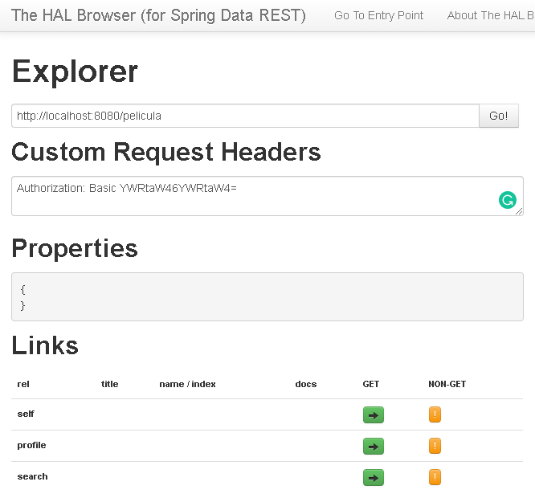

# ERP Server ZoomX
## Descripción
Servidor de apoyo para Obligatorio 2020 de la asignatura "Programación de Aps. Distribuidas Java/.NET".  
**Carrera**: Analista en Informática / Universidad de la Empresa. 

## Ejecución  (Requiere java 8, se recomienda java 11)
El jar generado en la compilación queda con el nombre "erp-server-zoomx-0.0.1-SNAPSHOT.jar" en la ruta target/. Su ejecución se hace con:   
`$ java -jar erp-server-zoomx-0.0.1-SNAPSHOT.jar --server.port=XXXX`   
El puerto por default es 8080. Si se desea cambiar se puede usar la opción *--server.port=XXXX* para especificar el puerto de publicación de la aplicación. 

## Recursos disponibles
**Películas**:   
*URL*: http://localhost:8080/pelicula/   
**Géneros**:   
*URL*: http://localhost:8080/genero/
**Usuario**:   
*URL*: http://localhost:8080/usuario/

## Usuarios y roles
Se tienen dos roles "**ROLE_ADMIN**" y "**ROLE_USER**" con usuarios pre cargados.      
___
Con rol "**ROLE_USER**":    

*Usuario*: user
*Contraseña*: user

*Usuario*: usr
*Contaseña*: usr
___    
Con rol "**ROLE_ADMIN**":   
    
*Usuario*: admin
*Constraseña*: admin
   
*Usuario*: adm
*Contraseña*: adm

## Seguridad y recursos
El acceso a los recursos está protegido por autenticación HTTP Basic. Las URL y métodos permitidos por rol se describen a continuación:

*URL*: /pelicula/**   
*Métodos HTTP permitidos*: POST(ROLE_ADMIN), DELETE(ROLE_ADMIN), PUT(ROLE_ADMIN), PATCH(ROLE_ADMIN), GET(ROLE_ADMIN, ROLE_USER)

*URL*: /genero/**   
*Métodos HTTP permitidos*: GET(ROLE_ADMIN, ROLE_USER)

*URL*: /usuario/**   
*Métodos HTTP permitidos*: GET(ROLE_ADMIN, ROLE_USER)  

## Tipos de peticiones soportadas
### GET (Select de registro)
*Ejemplo de petición con rol ROLE_ADMIN*:

```kotlin
  @Test
  @Throws(IOException::class)
  fun givenAuthUser_whenGetUsuario_thenGetResponseOk() {
    val client = OkHttpClient()
    val request = Request.Builder()
        .url("http://localhost:8080/usuario")
        .header("Authorization", Credentials.basic("adm", "adm"))
        .build()
    val rolExpected = "ROLE_ADMIN"

    val response = client.newCall(request).execute()

    assertSoftly {
      it.assertThat(response.code).isEqualTo(200)
      it.assertThat(response.body!!.string()).contains(rolExpected)
    }
    response.close()
  }
```
*Respuesta*:   
Código HTTP: **200** OK   
Body (Objeto consultado):  

```json
{
  "password": null,
  "username": "admin",
  "authorities": [
    {
      "authority": "ROLE_ADMIN"
    }
  ],
  "accountNonExpired": true,
  "accountNonLocked": true,
  "credentialsNonExpired": true,
  "enabled": true
}
```

### POST (Insert de registro)
*Ejemplo de petición con rol ROLE_ADMIN*:   

```kotlin
  @Test
  @Throws(IOException::class)
  fun givenAdmin_whenPostPelicula_thenGetResponse201() {
    val client = OkHttpClient()
    val JSON = "application/json; charset=utf-8".toMediaTypeOrNull()
    val json = """
      {"director": "Carlos3000",
      "titulo": "Test 123",
      "fecha_estreno": "2019-12-12",
      "poster": "https://as.com/meristation/imagenes/2019/03/19/noticias/1553025770_364735_1553025920_sumario_normal2.jpg",
      "genero":"http://localhost:8080/genero/2"}""".trimIndent()
    val body = json.toRequestBody(JSON)
    val request = Request.Builder()
        .url("http://localhost:8080/pelicula")
        .header("Authorization", Credentials.basic("adm", "adm"))
        .post(body).build()
    val response = client.newCall(request).execute()

    assertThat(response.code).isEqualTo(201)
    response.close()
  }
```
*Respuesta*:   
Código HTTP: **201** Created   
Body (Objeto creado):  

```json
{
  "titulo" : "Test 123",
  "director" : "Carlos3000",
  "fechaEstreno" : "2019-10-25",
  "poster" : "https://as.com/meristation/imagenes/2019/03/19/noticias/1553025770_364735_1553025920_sumario_normal2.jpg",
  "_embedded" : {
    "genero" : {
      "nombre" : "Aventura"
    }
  },
  "_links" : {
    "self" : {
      "href" : "http://localhost:8080/pelicula/4"
    },
    "pelicula" : {
      "href" : "http://localhost:8080/pelicula/4"
    },
    "genero" : {
      "href" : "http://localhost:8080/pelicula/4/genero"
    }
  }
}
```

### PATCH (Update de todo un registro)
*Ejemplo de petición con rol ROLE_ADMIN*:   

```kotlin
  @Test
  @Throws(IOException::class)
  fun givenAdmin_whenPutPelicula_thenGetResponse204() {
    val client = OkHttpClient()
    val JSON = "application/json; charset=utf-8".toMediaTypeOrNull()
    val json = """
      {"director": "null",
      "titulo": "Test 123",
      "fechaEstreno": "2019-12-10",
      "poster": "https://as.com/meristation/imagenes/2019/03/19/noticias/1553025770_364735_1553025920_sumario_normal2.jpg",
      "genero":"http://localhost:8080/genero/2"}""".trimIndent()
    val body = json.toRequestBody(JSON)
    val request = Request.Builder()
        .url("http://localhost:8080/pelicula/1")
        .header("Authorization", Credentials.basic("adm", "adm"))
        .patch(body).build()
    val response = client.newCall(request).execute()

    assertThat(response.code).isEqualTo(204)
    response.close()
  }
```

*Respuesta*:   
Código HTTP: **200** OK     
Body (Objeto actualizado):   

```json
{
  "titulo" : "Test 123",
  "director" : "null",
  "fechaEstreno" : "2019-12-10",
  "poster" : "https://as.com/meristation/imagenes/2019/03/19/noticias/1553025770_364735_1553025920_sumario_normal2.jpg",
  "_embedded" : {
    "genero" : {
      "nombre" : "Sci-Fi"
    }
  },
  "_links" : {
    "self" : {
      "href" : "http://localhost:8080/pelicula/1"
    },
    "pelicula" : {
      "href" : "http://localhost:8080/pelicula/1"
    },
    "genero" : {
      "href" : "http://localhost:8080/pelicula/1/genero"
    }
  }
}
```

### DELETE (Borrado de registro)
*Ejemplo de petición con usuario ROLE_ADMIN*:   

```kotlin
  @Test
  @Throws(IOException::class)
  fun givenAdmin_whenDeletePelicula_thenGetResponse204() {
    val client = OkHttpClient()
    val request = Request.Builder()
        .url("http://localhost:8080/pelicula/1")
        .header("Authorization", Credentials.basic("adm", "adm"))
        .delete().build()

    val response = client.newCall(request).execute()

    assertThat(response.code).isEqualTo(204)
    response.close()
  }
```

*Respuesta*:   
Código HTTP: **204** No content     
Body: Sin contenido  

## Códigos HTTP adicionales soportados
**404** Not found (Recurso no encontrado, ruta inválida)   
**500** Internal Server Error (Operación Ilegal, Validación de tamaño de campos/Datos nulos/formato de email)   
**401** Unauthorized (Acceso denegado, contraseña incorrecta, rol sin privilegios)   

## Utilidades embebidas
Una vez ejecutada la aplicación podra consultar las siguientes utilidades embebidas:   
1. **HAL Explorer**: Permite explorar los endpoint del servidor a través de navegación.  
*URL Acceso*: [http://localhost:8080/explorer/index.html#/](http://localhost:8080/explorer/index.html#)
Para acceder a los endpoints protegidos con HTTP Basic deberá agregar en los "Custom Request Headers" el valor:   
Authorization: Basic YWRtaW46YWRtaW4=    
Donde "YWRtaW46YWRtaW4="" es el Base64 de admin:admin.        
  
Figura 1. Captura de Hal Browser
   
2. **H2 Console**: Consola para realizar consultas SQL y administrar la base de datos H2.   
*URL Acceso*: [http://localhost:8080/h2-console/](http://localhost:8080/h2-console/)   
**Parámetros de conexión:**   
*Driver*: org.h2.Driver   
*JDBC URL*: jdbc:h2:mem:classdb;DB_CLOSE_DELAY=-1;DB_CLOSE_ON_EXIT=FALSE  
*User Name*: sa   
*Password*:   

3. http://localhost:8080/v3/api-docs


Figura 2. Login H2 Console


Figura 3. Manager H2 Console

# Deploy en OCP

`$ mvn clean fabric8:deploy -Popenshift`